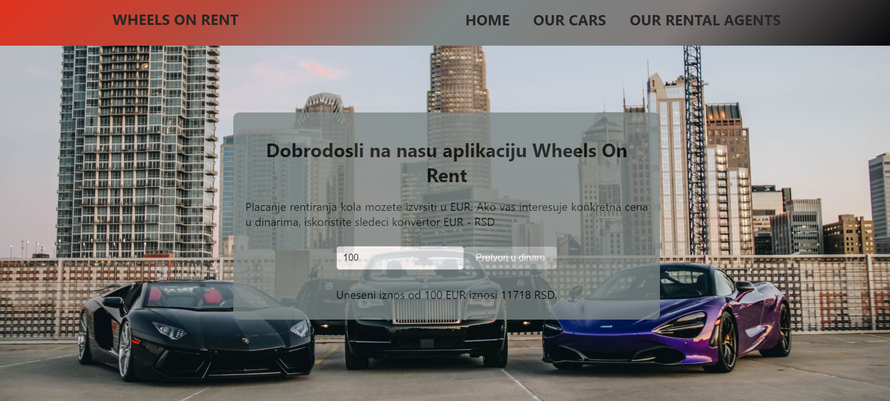
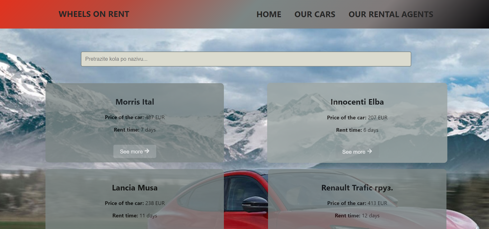
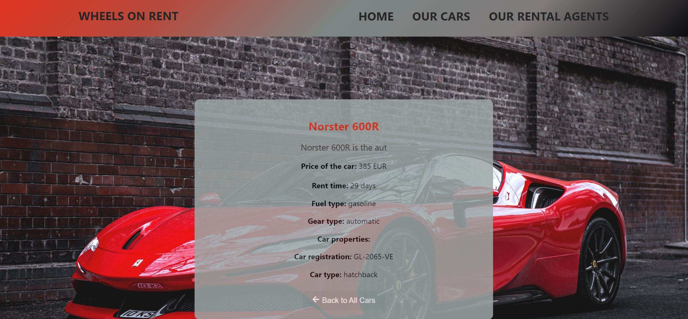
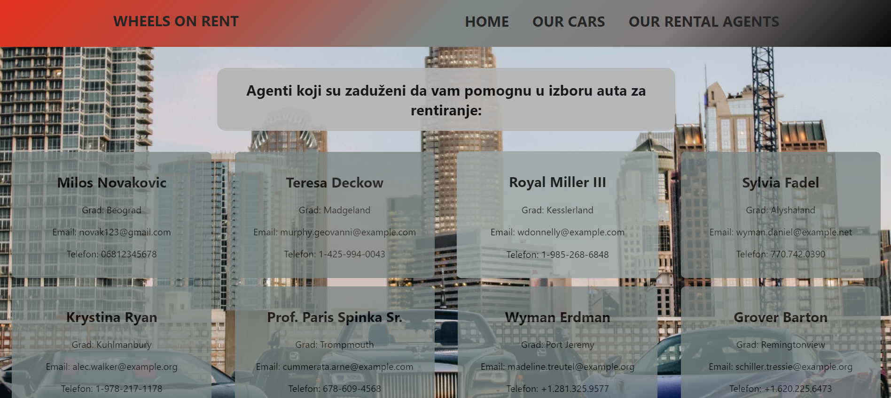

# Wheels On Rent - React Application

Welcome to Wheels On Rent, your go-to platform for renting cars conveniently and hassle-free. This user-friendly application is built using React, a powerful JavaScript library for building user interfaces. With React, Wheels On Rent offers a seamless and dynamic experience for users looking to rent cars for their travels or adventures.

## Main Components:

### Home Page:
The Home page welcomes users with informative text about the "Wheels On Rent" application. Additionally, users can use an interactive currency converter to convert prices from euros to dinars, providing transparency in rental prices.

### Cars List:
The Cars List component enables users to browse available cars for rent. Users can search for cars by name and easily navigate through pagination to see all available options.

### Car Details:
The Car Details component provides comprehensive information about the selected car, including description, price, rental duration, fuel type, transmission type, license plates, and car classification.

### Rental Agents List:
The Rental Agents List component allows users to find and contact agents who can provide additional information and assistance regarding car selection.

## Features:
- User-friendly interface for easy car rental.
- Comprehensive details about each car for informed decision-making.
- Interactive currency converter for transparent pricing.
- Easy navigation and pagination for browsing through available cars.
- Contact information for rental agents to assist users further.

## Photo Gallery:
Please find below the photo gallery showcasing different pages of the Wheels On Rent application:

### Home Page
<p align="center">
  
</p>

### Cars List
<p align="center">
  
</p>

### Car Details
<p align="center">
  
</p>

### Rental Agents List
<p align="center">
  
</p>

## Technologies Used:
- React.js for frontend development
- JavaScript for scripting
- HTML and CSS for styling
- Integration with backend Rent-A-Car application

  # How to Use Wheels On Rent - React Application

To use the Wheels On Rent React application, follow these steps:

## Prerequisites:
1. Ensure you have Node.js installed on your machine. You can download and install it from [Node.js website](https://nodejs.org/).
2. Clone the Wheels On Rent React application repository from GitHub.

## Installation:
1. Navigate to the directory where you have cloned the Wheels On Rent React application repository.
2. Open a terminal or command prompt in that directory.

## Starting the Frontend:
1. Before starting the frontend, ensure that you have also set up and started your backend Rent-A-Car application (you can find it in one of my repos) . 
2. Navigate to the frontend directory in your terminal:
    ```
    cd path/to/rent-a-car-frontend
    ```
3. Install dependencies by running the following command:
    ```
    npm install
    ```
4. Once the installation is complete, start the development server by running:
    ```
    npm start
    ```
5. The application will start running, and you can access it in your web browser at the provided URL (http://localhost:3000).

## Starting the Backend:
1. Ensure that you have set up and configured your backend Rent-A-Car application.
2. Navigate to the directory where your backend application is located.
3. Start the backend server according to the instructions provided in the backend's README file.


